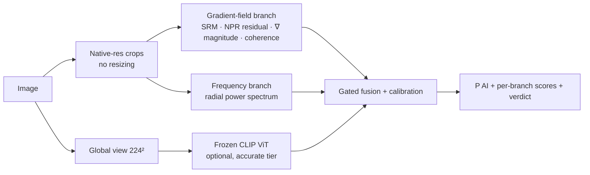

# 🛰️ fakeradar

**Local-first AI-generated image detection.** Gradient-field forensics + frequency analysis + frozen foundation-model semantics, fused into one calibrated score — on your own machine. No uploads, no API keys, no cloud.

[](https://github.com/JitendraJha98/fakeradar/actions/workflows/ci.yml)
[](https://github.com/JitendraJha98/fakeradar/actions/workflows/codeql.yml)
[](https://securityscorecards.dev/viewer/?uri=github.com/JitendraJha98/fakeradar)
[](https://codecov.io/gh/JitendraJha98/fakeradar)
[](https://pypi.org/project/fakeradar/)
[](LICENSE)
[](pyproject.toml)

---

## Why fakeradar

Most detectors fail in one of three ways. fakeradar is engineered against all three:

1. **They collapse on unseen generators.** Detectors trained on one model family memorize its artifacts. fakeradar fuses *complementary* forensic views — a gradient-field branch (our signature), a frequency-spectrum branch, and an optional frozen CLIP branch — so no single fingerprint is a point of failure, and the frozen semantic features carry generalization to generators never seen in training.
2. **They die on JPEG.** One WhatsApp forward destroys most published detectors. fakeradar trains *through* a simulated transport chain (JPEG/WebP re-encode, resize, blur, noise) and reports robustness tables, not just clean-set accuracy.
3. **They silently destroy evidence.** Resizing everything to 224×224 erases the high-frequency traces detection depends on. fakeradar scores **native-resolution crops** and aggregates — the forensic signal is never resampled away.

And one product decision on top: **everything runs locally.** The `fast` tier is ~12M params, CPU-friendly, fully offline, ONNX-exportable. Images being checked are often sensitive — they shouldn't have to leave your machine.

## Quickstart

```bash
pip install fakeradar            # core (fast tier)
pip install 'fakeradar[all]'     # + CLIP branch, REST API, ONNX, demo

fakeradar scan photo.jpg holiday_album/
```

```text
┌────────────────┬────────┬────────────┬────────────────────────────────┐
│ image          │  P(AI) │ verdict    │ branches                       │
├────────────────┼────────┼────────────┼────────────────────────────────┤
│ photo.jpg      │  0.912 │ likely_ai  │ gradient:0.94  frequency:0.87  │
└────────────────┴────────┴────────────┴────────────────────────────────┘
```

Python API:

```python
from fakeradar import Detector

det = Detector(tier="fast", checkpoint="runs/fast_v0/best.pt")
r = det.predict("photo.jpg")
print(r.prob_ai, r.verdict, r.per_branch)
```

Local REST API: `fakeradar serve --checkpoint best.pt` → `POST /v1/detect`.

> **Weights status:** v0.1 pretrained weights are being trained now (see [ROADMAP.md](ROADMAP.md)) and will be published to the Hugging Face Hub. Until then: train your own with one command (below) or pass `--untrained-ok` for pipeline smoke tests.

## Architecture



| Tier | Branches | Params (trainable) | Offline | Target hardware |
|---|---|---|---|---|
| `fast` | gradient + frequency | ~12M | ✅ fully | any CPU / laptop |
| `accurate` | + frozen CLIP ViT-B | ~13M (+86M frozen) | after 1 download | GPU preferred, CPU works |

Design details: [docs/architecture.md](docs/architecture.md).

## Train your own

```bash
python scripts/prepare_genimage.py /data/GenImage --generators stable_diffusion_v_1_4
fakeradar train configs/train_fast.yaml            # ~2-4h on one A100
fakeradar benchmark data/manifests/val.csv --checkpoint runs/fast_v0/best.pt
fakeradar robustness data/manifests/val.csv --checkpoint runs/fast_v0/best.pt
```

## Benchmarks

Protocol: train on **one** generator (GenImage SD v1.4), evaluate on **all eight** + in-the-wild sets, clean **and** perturbed. Full protocol in [docs/benchmarks.md](docs/benchmarks.md).

| generator | AUROC | acc@0.5 |
|---|---|---|
| *(published with v0.1 weights — training in progress)* | – | – |

We publish robustness tables alongside every release. A detector that only reports clean-set accuracy is hiding something.

## Local & edge deployment

```bash
fakeradar export-onnx runs/fast_v0/best.pt fakeradar_fast.onnx
```

The fast tier exports to a single ONNX graph (dynamic batch) for onnxruntime on CPU, with int8 quantization on the roadmap.

## Limitations — read this

- Output is a **probabilistic signal, not proof**. Never treat one score as evidence for accusing a person or authenticating media in legal, journalistic, or academic-integrity settings.
- Detection is an **arms race**: new generators and adversarial post-processing can defeat any detector, including this one. Robustness has known theoretical limits.
- Scores are calibrated on our validation data; heavy out-of-distribution content (screenshots, scans, heavy edits, partial AI inpainting) may land in `uncertain` — that verdict exists on purpose.

## Contributing & community

New generator coverage requests, failure-case reports, and new forensic branches are the most valuable contributions — see [CONTRIBUTING.md](CONTRIBUTING.md) and the [new-generator issue template](.github/ISSUE_TEMPLATE/new_generator_request.md). Project plans: [ROADMAP.md](ROADMAP.md) · [LAUNCH_PLAN.md](LAUNCH_PLAN.md).

## Citation

```bibtex
@software{fakeradar2026,
  author = {Jha, Jitendra},
  title  = {fakeradar: local-first AI-generated image detection},
  year   = {2026},
  url    = {https://github.com/JitendraJha98/fakeradar}
}
```

Research paper (GRAFT) in preparation — see [paper/](paper/).

## License

Apache-2.0 — free for commercial and research use, with an explicit patent grant.
